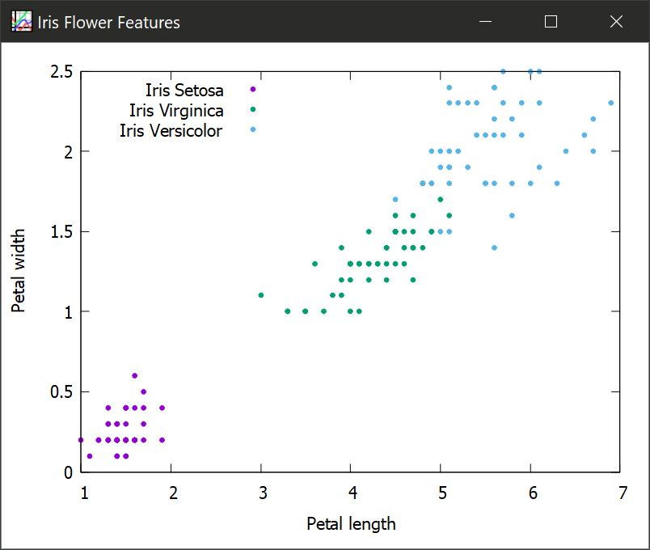

# PasML
A collection of machine learning algorithms for object pascal.

## Implemented algorithms
|Category|Type|Model|Notes|
|---|---|---|---|
|Unsupervised|Clustering|K-Means|Only random centroid initialization. Gladly accept your contribution.|
|Supervised|Classification|Decision Tree|C4.5 implementation. Continuous data handling only for now.|
|Supervised|Classification|Naive Bayes|Gaussian naive bayes|


## Numerik compatibility
```pascal
Dataset := ReadCSV('datasets/iris.csv');
X := Dataset[[_ALL_, [0, 1, 2, 3]]];
y := Dataset[[_ALL_, 4]];
```

## Clustering example

```pascal
kmeans := TKMeans.Create(3);
kmeans.Fit(X);
WriteLn('Clustering result:');
PrintMultiArray(kmeans.Predict(X));
```

## Classification example

```pascal
nb := TNaiveBayesClassifier.Create;
nb.Fit(X, y);
pred := nb.Predict(X);

WriteLn('Accuracy:');
WriteLn(Mean(pred = Ravel(y)).Item);
```

## Integration with gnuplot
PasML has gnuplot integration support. Currently only scatter and line plots are supported.
```pascal
fig := TFigure.Create('Iris Flower Features', 'Petal length', 'Petal width');
fig.AddScatterPlot(X[[_ALL_, [2, 3]]].SliceBool([y = 0]), 'Iris Setosa');
fig.AddScatterPlot(X[[_ALL_, [2, 3]]].SliceBool([y = 1]), 'Iris Virginica');
fig.AddScatterPlot(X[[_ALL_, [2, 3]]].SliceBool([y = 2]), 'Iris Versicolor');
fig.LegendPosition := lpLeftTop;
fig.Show;

fig.Free;                                                                    
```

</img>

## Note
- PasML requires [numerik](https://github.com/ariaghora/numerik), so you should install it first. Refer to numerik installation [guide](https://github.com/ariaghora/numerik#installation).
- If you want to work with neural network, please check [noe](https://github.com/ariaghora/noe) framework that was designed specifically for this task.
